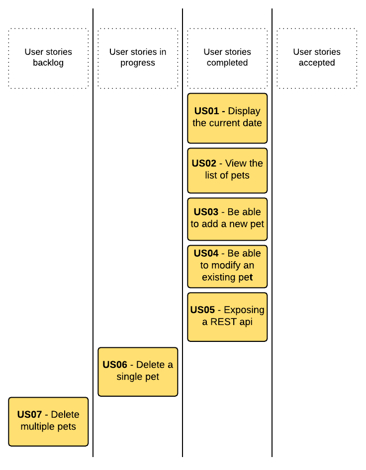

# Assignment
## Intro

The Scrum team went through one week of development (of a two weeks sprint), and delivered this petstore project to our GIT. Your role as a QA automation engineer, is to automate the UI testing (*acceptance testing*) based on the user stories by using **Robot** and **Selenium**.
In accordance to the NFR in our definition of done, you're also encouraged to verify and assess the performance of the application by using a tool like **JMeter** or any other tool of preference.
You will find below the users stories and DoD that might guide you on your journey.

Prioritizing your work is advised in case you run out of time.  
**Choose wisely** !

## Expected output
**The product owner** is going to execute your automated tests against the stable DEV environment in order to assess if the stories can be moved from *Completed* to *Accepted*.
To make this possible, we expect you to provide minimal instructions on how to re-execute your tests.

**A QA engineer** will do a pair review of your code to asses its quality, coherence, and portability.

# The Kanban board at mid sprint

# User stories and definition of Done
[User stories and DoD](./assignment/USER-STORIES.md)

# How to run the application
## Prerequisites to install
*The team tested the app on MacOSX & Windows 7, it should work on Linux as well*
- Version 4.3.1 of Node.js.

## Download app dependencies
*Depending on your system, you might need to execute npm with admin rights.*

- Navigate to project root folder and type `npm install`.
- Navigate to project root folder and type `bower install`.

## Build the app
- Navigate to project root and type `grunt dist`.

## Run the app
- Navigate to project root folder and type
`./node_modules/json-server/bin/index.js --watch src/server/db.json --routes src/server/routes.json --static src/client`.

## Accessing the app
[Petstore web app](http://localhost:3000)

## Useful
- [Node.js website](https://nodejs.org/en/download/)
- [Python](https://www.python.org/downloads/)
- [Robot](http://robotframework.org/)
- [Selenium](http://www.seleniumhq.org/)
- [Eclipse](https://eclipse.org/downloads/)
- [Robot - Eclipse IDE](https://github.com/NitorCreations/RobotFramework-EclipseIDE)
- [JMeter](http://jmeter.apache.org/)
