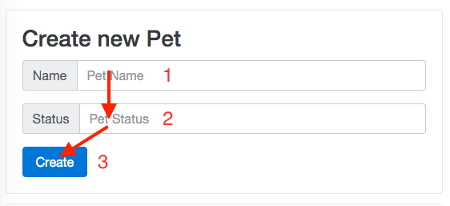

# Team definition of Done (extract)
- ...
- The website is responsive and all features work on small screens (> 400px width)
- Supported browser is Chrome (latest version)
- Unit tests coverage are over 60%
- ...

# User stories
## US05 - Exposing a REST API
Story points captured during Spring planning : 13

### Description
As a pet store user I want to access my resource by using the following REST API :

- GET /api/pets
- GET /api/pets/{id}
- PUT /api/pets/{id}
- DELETE /api/pets/{id}
- POST /api/pets

### Acceptance Criteria
API strictly respects this Swagger definition : [Swagger](https://cdn.rawgit.com/jmichelgarcia/petstore-assignment/master/src/client/swagger.html)

## US01 Display the current date
Story points captured during Spring planning : 3

### Description
As a pet store user I want to see the current date displayed

### Acceptance Criteria
Given the user has accessed the webapp  
When the page is rendered on the user's browser,  
Then He sees the date of the day displayed on the top right part of the page  
And the date format is : DD-MM-YYYY, ie 31-12-2016  
And The background color of the banner is black

## US03 - Be able to add a new pet
Story points captured during Spring planning : 13

### Description
As a pet store user I want to be able to add a new pet so that I can add new pets to my collection

### Acceptance Criteria
Given the user has accessed the webapp   
When the page is rendered on the user's browser  
And the user tries to add a new pet   
Then **Pet Name** and **Pet Status** are both **mandatory** fields

Given the user has accessed the webapp   
When the page is rendered on the user's browser  
And the user has entered **Name** and **Status**   
Then he is able to validate his input by using either keyboard `Enter key` or by clicking on the `Create button`

Given the user has accessed the webapp   
When the page is rendered on the user's browser
And the user has focus on the **Pet Name** field
Then the following accessibility sequence should be    respected when pressing the `TAB` keyboard key

Given the user has accessed the webapp   
When the page is rendered on the user's browser   
And the user has focus on the **Pet Status** field   
And the user has pressed the keys `SHIFT` + `TAB`  
Then the focus should be on the **Pet Name** field   

## US02 View the list of pets
Story points captured during Spring planning : 8

### Description
As a pet store user I want to see my current pets so that I can view all my pets in one page.

### Acceptance Criteria
Given the user has accessed the webapp   
When the page is rendered on the user's browser   
Then the list of pets displayed in a table like component   
And I'm able to view my pets *Name* and *Status*

Given the user has accessed the webapp   
When the page is rendered on the user's browser   
And 100 pets are loaded   
Then the list of pets displayed in a table like component   
And the page is loaded in less than 2 seconds

## US04 - Be able to modify an existing pet
Story points captured during Spring planning : 10

### Description
As a pet store user I want to be able to modify existing pets so that I can update their name or/and status.

### Acceptance Criteria
Given the user has accessed the webapp   
When the page is rendered on the user's browser   
And a list of pets is displayed   
Then the user should be able to edit a pet by clicking on the existing pet `name` or pet `status`

Given the user has accessed the webapp   
When the page is rendered on the user's browser   
And a list of pets is displayed   
And the user is editing a pet    
Then the user has the following 3 ways to quit the editing of the pet
- Pressing the `Esc key` => Changes should be **discarded**.
- Pressing the `Enter key` => Changes should be **saved**.
- Clicking outside the edition zone => Changes should be **saved**.
